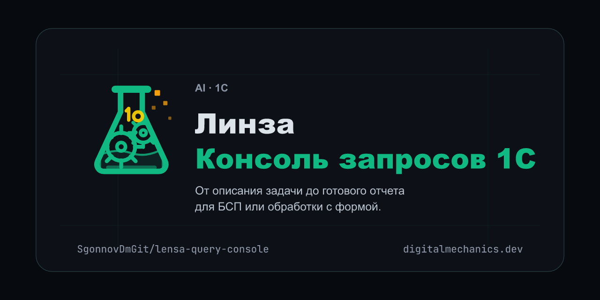

 Статья на Инфостарте: [Внешняя обработка в 1С без конфигуратора: от задачи словами до .epf с ИИ-агентом](https://infostart.ru/public/2789002/)

  

  
  
  
  

# Консоль запросов 1С с ИИ «Линза»

Внешняя обработка для 1С:Предприятие: консоль запросов, в которой ИИ-помощник читает
метаданные вашей конфигурации и собирает запрос по вашим регистрам. Текст запроса виден
до выполнения, результат считается на ваших данных.

**Демо-редакция бесплатна и бессрочна.** Здесь лежит она - забирайте в
[Releases](../../releases/latest).

В репозитории - готовая обработка `.epf`. Код внутри открыт: обработка
открывается в конфигураторе, читается и правится. Права на продукт остаются
у правообладателя, условия в [LICENSE.md](LICENSE.md).

  

Задача поставлена словами: «Нужно вывести прайс на дату с остатками». Агент нашел два
регистра цен, выбрал нужный, собрал пакетный запрос с временными таблицами и применил
его в редактор. В панели «Ход» видно, сколько контекста ушло на обход: 22 564 токена
из 200 000.

## Зачем это

Три вещи, из-за которых ИИ в 1С обычно не взлетает, - и что с ними здесь.

- **Модель не знает вашу конфигурацию** и выдумывает имена таблиц и реквизитов.
  Здесь агент сначала читает метаданные вашей базы - типы объектов, структуру регистров,
  реквизиты - и только потом пишет запрос. Каждый его шаг виден в ленте.
- **Страшно пускать ИИ к учетной базе.** Агент работает с запросом, а не с данными:
  текст виден до выполнения, результат считается в вашей базе и остается в ней. В Демо
  агент строки результата не читает вовсе; в полной версии каждое такое обращение
  показывается вам и подтверждается отдельно.
- **Обвязка из редактора, модели, скиллов и MCP-серверов** - это отдельный проект по
  установке и настройке. Здесь одна обработка `.epf`, подключается штатным механизмом
  БСП, ключ вводится в настройках - и все.

А когда запрос готов, из него за один шаг собирается внешний отчет или обработка,
которые подключаются к базе так же штатно.

---

## Что это

Обычная внешняя обработка `.epf`. Подключается к конфигурации на БСП штатным механизмом
дополнительных отчетов и обработок - **без правок в конфигураторе**.

Готовый запрос можно оформить во внешний отчет `.erf` или во внешнюю обработку `.epf`
с формой. Оба подключаются туда же и тем же способом. В отчет выводятся в том числе
картинки - например прайс с фотографиями номенклатуры.

## Как это выглядит

**Агент идет по метаданным вашей конфигурации.** Каждый шаг виден: какие типы объектов
просмотрел, какие структуры прочитал, какой навык подключил. В панели «Ход» - контекст
и стоимость обхода.

**Из готового запроса - внешний отчет за один шаг.** Мастер берет поля из запроса,
группировки и ресурсы назначаются перетаскиванием, на выходе файл `.erf`, который
подключается к базе штатно.

**Результат - обычный отчет 1С**, в том числе с картинками из базы.

Кадры сняты в полной редакции. В Демо тот же агент, те же мастера и тот же результат;
отличается редактор - в Демо он «Стандартный», без подсветки, и нет вкладки «Навигатор
таблиц». Полный список различий - в таблице ниже.

## Требования

| | |
|---|---|
| Платформа | 1С:Предприятие **8.3.16** и новее, включая 8.5 |
| Режим | Управляемые формы |
| Библиотека | БСП - для подключения штатным механизмом |
| Доступ в сеть | Нужен только для ИИ-помощника. Консоль без ИИ работает офлайн |

## Установка

1. Скачать `.epf` из [Releases](../../releases).
2. Открыть в 1С: **Файл → Открыть**, либо подключить как дополнительную обработку
   (Администрирование → Печатные формы, отчеты и обработки).
3. Для работы ИИ - указать ключ в настройках обработки.

## Что работает в Демо

| Возможность | Демо |
|---|---|
| Выполнение запросов | да |
| Штатный конструктор запросов 1С | да |
| Редактор запроса | «Стандартный» |
| Параметры запросов, ограничение вывода, автосохранение | да |
| Файлы списков `.q1cs` и отдельных запросов `.q1c` | да |
| Нормализация запроса, текст и код для Конфигуратора | да |
| ИИ-агент: работа по метаданным и применение правок | да |
| Мастер внешнего отчета `.erf` | да |
| Мастер внешней обработки `.epf` | да |
| История и выбор диалогов | да |
| Фоновое выполнение запросов | нет |
| Навигатор пакетов и временных таблиц | нет |
| Профессиональный редактор запроса | нет |

Полное сравнение редакций - [docs/Сравнение_полной_и_демо_версий.md](docs/Сравнение_полной_и_демо_версий.md).

## Про ключ и монеты

Выполнение запросов и конструктор работают без всякого ключа - скачал и работай.

**ИИ-помощнику нужны монеты.** Монеты выдаются при регистрации на сайте, стартовый
грант - 500. Обращение к ИИ списывает монеты, сборка готового файла стоит одну монету.
Ключ, полученный при регистрации, открывает также канал обновлений Демо-редакции.

Регистрация: [digitalmechanics.dev](https://digitalmechanics.dev/?utm_source=github&utm_medium=repo&utm_campaign=gh-readme)

## Статус

**Боевая, не превью.** Демо-редакция обновляется теми же выпусками, что и полная:
с конца июля 2026 вышло больше пятидесяти версий, список с описанием каждой -
в [Что нового](docs/ЧтоНового.md). Ключ, полученный при регистрации, открывает канал
обновлений прямо из обработки - следить за Releases руками не нужно.

Ошибки и пожелания - в [Issues](../../issues); на них отвечают.

## Документация

- [Что нового в Демо-версии](docs/ЧтоНового.md) - список изменений по версиям
- [Сравнение полной и Демо-версий](docs/Сравнение_полной_и_демо_версий.md)
- [Справка](docs/Справка_КонсольЗапросов.md) - полное руководство по Демо-редакции.
  Та же справка встроена в саму обработку.

## Видео

Короткие ролики без склеек, каждый - одна задача от постановки до результата.

| Ролик | О чем |
|---|---|
| [Внешняя обработка в 1С за минуту](https://youtube.com/shorts/IIMel4Gas2o) | задача словами, агент правит запрос под обработку, мастер собирает `.epf`, реквизит у номенклатуры заменен |
| [ИИ пишет запрос по задаче словами](https://youtube.com/shorts/Dr52djm1YLc) | от формулировки до готового отчета |
| [Ошибка в запросе: подсветка, исправление, подсказки](https://youtube.com/shorts/2olPHm_bgAA) | что делать с запросом, который уже написан |
| [Тяжелый запрос считается в фоне](https://youtube.com/shorts/zFnqBeyO9-0) | база и другие запросы не ждут (полная редакция) |
| [Установка, первый запуск и доступ к ИИ](https://youtu.be/Ze2s3wSkyUw) | 2:32, с озвучкой - для первого запуска |
| [Отчет по выручке с фото товаров в УТ 11.5](https://youtu.be/NhONb6cleGM) | 2:14, полный путь от задачи словами до отчета с картинками |

Все ролики - на канале [@LenSaCodeAI](https://www.youtube.com/@LenSaCodeAI).

## Полная версия

Профессиональный редактор с подсветкой и автодополнением, фоновое выполнение, навигатор
пакетов и временных таблиц, анализ строк результата ИИ-агентом. Продается одним платежом,
без подписки - [digitalmechanics.dev/lensa/query-console](https://digitalmechanics.dev/lensa/query-console?utm_source=github&utm_medium=repo&utm_campaign=gh-readme)

## Лицензия

Демо-редакция распространяется бесплатно и бессрочно. Это **не open source** -
исходный код обработки открыт для чтения и правки внутри вашей 1С, но права на продукт
принадлежат правообладателю. Условия - [LICENSE.md](LICENSE.md).

## Обратная связь

Вопросы, ошибки и пожелания - в [Issues](../../issues).
