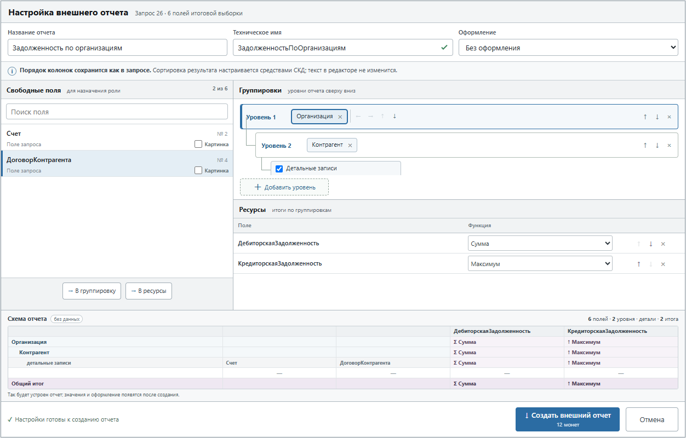
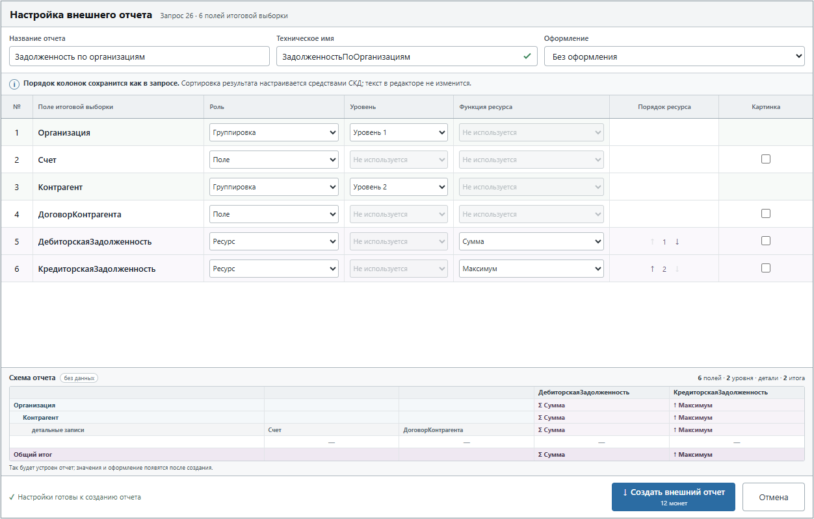
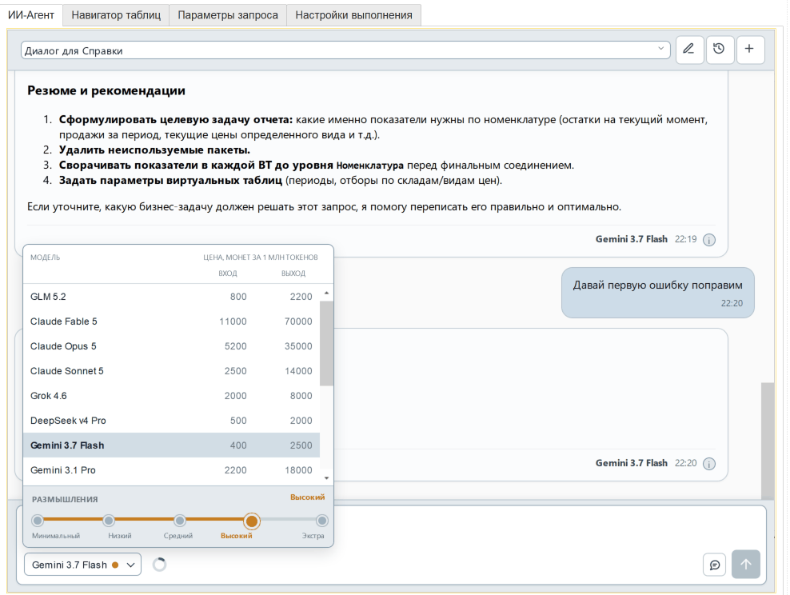
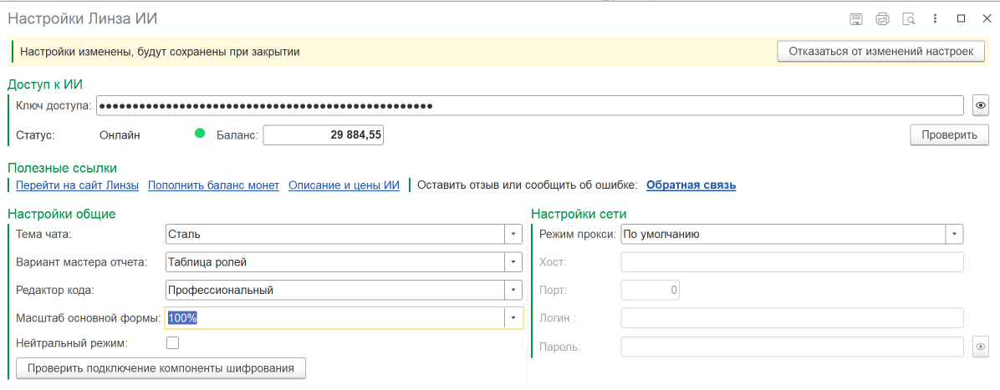
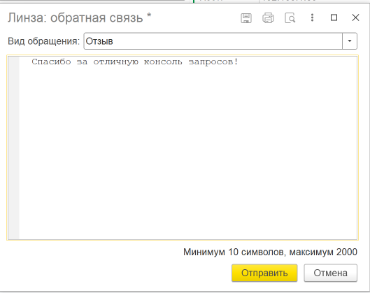

# Консоль запросов 1С с ИИ «Линза». Демо-версия

Демо-версия объединяет консоль запросов 1С, стандартный редактор и чат с ИИ. В обработке можно хранить несколько запросов, выполнять их и анализировать результат, а затем просить ассистента написать, исправить или объяснить запрос с учётом метаданных текущей базы.

## Быстрый старт

1. Откройте обработку и создайте запрос кнопкой **Добавить** либо загрузите существующий файл.
2. Введите текст в редакторе. Параметры и временные таблицы обновятся после разбора запроса.
3. Заполните значения на вкладке **Параметры запроса**.
4. Нажмите **Выполнить запрос** или `Ctrl+Enter`.
5. Для работы с ИИ откройте **Настройки**, укажите ключ API, вернитесь на вкладку **ИИ-Агент** и отправьте задачу внизу чата.

## Файлы и список запросов

Верхняя таблица содержит запросы текущего рабочего файла. У каждой строки свои текст, параметры, временные таблицы, результат последнего выполнения и диалоги с ИИ.

- Рабочий список сохраняется в файл `.q1cs` кнопками рядом с именем файла.
- Отдельный запрос можно импортировать или экспортировать в `.q1c` через команды списка.
- **Новый файл** очищает имя рабочего файла, список запросов, редактор и связанные данные. Несохранённые изменения прежнего списка после этого не восстанавливаются.
- При переключении между строками текст и настройки каждого запроса сохраняются в списке.
- Список запросов можно свернуть. В заголовке остаются имя текущего запроса и количество строк.

## Редактор запроса

В Демо-версии используется стандартный редактор на штатном поле 1С. Он быстро открывается и не загружает дополнительные веб-компоненты. Выполнение, проверка запроса, применение правок ИИ, конструктор запроса, нормализация, текст для Конфигуратора и мастера внешних файлов доступны через обычные команды и контекстное меню. При ожидании ответа ИИ редактор становится только для чтения, чтобы ручная правка не разошлась с применяемой версией запроса.

Состояние валидности показывается рядом с текущим запросом. После изменения текста обработка обновляет:

- список параметров;
- состав пакетов и временных таблиц;
- навигацию по запросу;
- текст ошибки, если запрос не разбирается платформой.

### Команды редактора

- **Нормализовать запрос** в контекстном меню приводит корректный текст к каноническому формату средствами платформы. Изменение можно отменить одним нажатием `Ctrl+Z`; если запрос не разбирается, текст остаётся прежним и выводится описание ошибки.
- **Конструктор запроса** открывает стандартный конструктор 1С и возвращает изменённый текст в редактор.
- **Сформировать внешний отчёт** открывает мастер настройки состава отчёта, а после подтверждения создаёт и сохраняет готовый файл `.erf`.
- **Сформировать внешнюю обработку** открывает отдельный мастер формы и действий над результатом запроса, а после подтверждения создаёт и сохраняет готовый файл `.epf`.

## Параметры запроса

На вкладке **Параметры запроса** задаются значения и типы найденных параметров. Поддерживаются одиночные значения и списки. Команда очистки удаляет строки параметров, которых больше нет в тексте.

## Выполнение и результат

Кнопка **Выполнить запрос** запускает текущую строку. На вкладке **Настройки выполнения** настраиваются вывод итогового результата, вывод временных таблиц, ограничение количества отображаемых строк и оформление через СКД.

Результат выводится табличным документом. Доступны расшифровка ссылочных значений, сохранение результата, изменение порядка таблиц и общий ползунок ширины колонок. Настроенная ширина хранится отдельно для каждой таблицы результата.

При выводе через СКД совместимые поля изображений и хранилищ отображаются картинками. В конфигурациях с совместимой БСП консоль также распознаёт поля точного типа **ПрисоединенныйФайл** и выводит содержащиеся в них изображения независимо от хранения в информационной базе или внешнем томе. Размер исходного изображения может влиять на высоту строки. В режиме Построителя неподдерживаемые сложные значения показываются безопасным текстовым представлением.

## Внешний отчёт ERF

Команда формирования отчёта открывает мастер и создаёт внешний отчёт на основе последнего результатного пакета запроса. Поддерживаются запросы без параметров, произвольные типизированные параметры и специальная пара `НачалоПериода` / `КонецПериода`, которая превращается в стандартный период отчёта.

### Имена и поля отчёта

В верхней части мастера задаются пользовательское и техническое имена отчёта. Техническое имя формируется автоматически по правилам имён 1С, но его можно изменить до создания файла.

Поле **Оформление** позволяет выбрать варианты «Без оформления», «Основной», «Море», «Арктика» или «Зеленый». При открытии мастер подхватывает текущее оформление результата; выбор действует только для создаваемого файла и не меняет общую настройку выполнения запросов.

Мастер показывает все поля итоговой выборки и позволяет назначить им роли:

- **Группировки** определяют уровни и порядок представления данных. В одном уровне может находиться несколько полей; уровни и поля внутри них можно перемещать стрелками.
- **Ресурсы** содержат рассчитываемые показатели. Для ресурса выбирается функция: сумма, количество, количество различных, среднее, максимум или минимум.
- **Детальные записи** включаются отдельным переключателем и добавляют строки исходной выборки под итогами группировок.

Поля с явной агрегатной функцией, например `СУММА(...)`, мастер старается сразу предложить как ресурсы. Это начальная раскладка: роль поля и функцию ресурса можно изменить вручную. Двойной щелчок по свободному полю быстро переносит его в группировку.

Флаг **Картинка** включает штатный вывод изображения для выбранного поля. Такое поле доступно только в детальных записях: мастер возвращает его из группировки или ресурсов, включает детальные записи и блокирует несовместимые роли. Если флаг снять, полю снова можно назначить обычную роль.

### Виды мастера

В настройках обработки выбирается один из двух видов мастера:

- **Конструктор** показывает общий пул полей, вложенные уровни группировок и список ресурсов отдельными рабочими областями. Он удобен для визуальной сборки структуры отчёта.
- **Таблица ролей** выводит те же поля компактной таблицей и позволяет назначать роль каждой строке. Она удобна, когда важен быстрый обзор всей раскладки.

Оба вида работают с одинаковыми настройками и создают один и тот же отчёт. Выбранный вид сохраняется между запусками обработки.

### Схема отчёта и создание

Нижняя часть мастера показывает **Схему отчёта** — уменьшенный лист будущего отчёта, построенный без выполнения запроса и без реальных данных. В шапке подписаны колонки ресурсов. Группировки показаны отдельными ярусами слева, и каждый ярус несёт собственные итоги ресурсов. Свободные поля подписаны в строке детальных записей, там же показаны итоги деталей; поле, выводимое картинкой, отмечено отдельно. Завершает схему общий итог. Значения в схеме заменены прочерками намеренно: мастер знает структуру будущего отчёта, но не его данные, поэтому показывать правдоподобные суммы было бы обманом. Справа от заголовка стоит сводка: сколько полей, уровней и итогов настроено и включены ли детальные строки.

Кнопка **Создать внешний отчёт** проверяет имена и распределение полей, после чего предлагает сохранить готовый файл `.erf`. Актуальная стоимость создания показывается второй строкой на кнопке. Если создать файл не удалось, мастер остаётся открытым: введённые имена и раскладка сохраняются, поэтому параметры можно исправить и повторить попытку. При недостатке монет мастер предлагает открыть страницу пополнения баланса. **Отмена** закрывает мастер без изменения текста запроса.

Для СКД результатная выборка должна находиться в последнем пакете, а промежуточные пакеты могут только помещать или уничтожать временные таблицы. Если в итоговом пакете установлено `АВТОУПОРЯДОЧИВАНИЕ`, мастер снимает его только в копии запроса для отчёта; текст в редакторе не меняется. Сортировку и группировки результата следует задавать настройками отчёта. Перед сохранением обработка проверяет запрос и объясняет, что нужно исправить, если отчёт сформировать нельзя.

## Внешняя обработка EPF

Команда **Сформировать внешнюю обработку** находится в контекстном меню редактора рядом с созданием внешнего отчёта. Она открывает мастер, в котором задаются наименование, техническое имя и версия обработки, выбираются параметры формы, ключевое поле результата и доступные действия над строками. Превью показывает будущую форму без выполнения запроса. После подтверждения сервис формирует готовый файл `.epf`.

Создание `.erf` и `.epf` тарифицируется сервером. Актуальная цена показывается рядом с действием создания. Монеты списываются только за успешно сформированный файл; повтор полностью идентичного запроса может быть бесплатным. После успешной генерации баланс на главной форме обновляется автоматически, а при недостатке монет обработка предлагает сразу перейти к пополнению.

## ИИ-Агент

Чат работает с запросом, который сейчас открыт в редакторе. Ассистент может исследовать метаданные конфигурации, объяснять запрос, находить ошибки, оценивать производительность и применять точечные изменения к тексту.
В Демо-версии ИИ изменяет только текст текущего запроса; значения и списочность параметров пользователь меняет вручную на вкладке **Параметры запроса**.

### Диалоги

В верхней строке чата выбирается диалог текущего запроса. Кнопка с карандашом открывает свойства: там можно переименовать или удалить начатый диалог и посмотреть расход по моделям. Кнопка с плюсом начинает новый диалог.

В подвале ответа показано компактное время. После повторного открытия истории полная дата и время доступны в информационной подсказке сообщения.

У каждого запроса свой набор диалогов. Модель начатого диалога хранится вместе с ним. Новый запрос или новый диалог сохраняет последнюю выбранную доступную модель; если её больше нет в каталоге, выбирается доступная модель той же семьи либо первая доступная.

### Модель и размышления

Список моделей показывает доступность и цену входящих и исходящих токенов в монетах за один миллион токенов. Недоступные модели остаются видимыми с пояснением, но выбрать их нельзя.

Уровень размышлений задаётся шкалой **Минимальный**, **Низкий**, **Средний**, **Высокий**, **Экстра**. По умолчанию используется средний уровень.

### Отправка, остановка и типовые вопросы

Введите сообщение в поле внизу чата и нажмите кнопку со стрелкой вверх. Во время ответа она заменяется кнопкой остановки. Остановка прекращает текущий ход, но уже сохранённые сообщения и применённые изменения остаются в диалоге.

Если сообщение превышает допустимый предел, консоль не начинает ход и сохраняет введённый текст для сокращения или разделения.

Панель **Типовые вопросы** вставляет готовую задачу в поле сообщения, например объяснение запроса или ревью производительности. Текст можно дополнить или изменить, а затем отправить обычной кнопкой. Перед отправкой также можно выбрать другую модель и уровень размышлений.

### Ход работы ИИ-агента

В сообщении агента отдельно показаны размышления и этапы работы. Статус этапа различает успешное выполнение, применение с предупреждением и ошибку. Для постраничного чтения справочников, составных типов и документов журнала этап показывает запрошенную часть списка, например позиции 21–40; последовательные страницы поэтому различимы и во время ответа, и после повторного открытия истории. Текст в редакторе меняется только после успешного этапа применения. Если этап завершился ошибкой, можно уточнить задачу или попросить ассистента исправить изменение.

В Демо-версии ассистент может прочитать имена, типы, списочность и заполненность параметров, но не устанавливает и не заменяет их значения. Откройте вкладку **Параметры запроса**, чтобы изменить значения параметров вручную.

По прямой просьбе ассистент может открыть конструктор запросов, мастер внешнего отчёта или обработки либо форму текста для Конфигуратора. Открытие не выполняет запрос, не создаёт файл и не списывает монеты: окончательное действие остаётся за пользователем.

### Контекст, расход и сжатие

Кольцо рядом с моделью ИИ показывает заполнение контекста текущего диалога. Цвет меняется от зелёного к оранжевому и красному по мере приближения к порогу, на котором контекст будет сжат автоматически. Наведите указатель, чтобы увидеть числа: сколько токенов занято и какой потолок к ним относится.

Кнопка с минусом запускает сжатие контекста. Подсказка кнопки начинается с того, доступно ли действие прямо сейчас: **Сжать контекст** — можно нажать, **Текущий контекст** — пока нельзя, но числа показаны, **Сжатие контекста** — недоступно, и названа причина. Причиной может быть недостаток контекста или завершённых обменов, незавершённые изменения запроса, отвечающий ИИ, невыбранный диалог либо временная недоступность сжатия. При недостатке контекста подсказка показывает прогнозируемое число токенов и порог, с которого сжатие возможно, — это другая величина, чем порог автоматического сжатия. Если попытка сжатия не удалась, причина показывается там же, в подсказке кнопки, а переписка остаётся чистой: следующая попытка или следующий ответ ИИ подсказку обновят. После завершённого хода и успешного сжатия состояние обновляется автоматически; цвет и процент кольца сами по себе доступность кнопки не определяют.

Пока сжатие выполняется, чат показывает отдельное состояние. Перед отправкой запроса обработка повторно проверяет доступность операции. Если сжатие уже выполняется или диалог ещё сохраняется, в чате появляется понятное сообщение; история при этом не очищается.

Завершённые сжатия отображаются в истории карточками **Контекст сжат** — по одной на каждый проход. Обработка сохраняет позиции карточек, заданные серверной историей; проходы с общей границей остаются в переданном сервером порядке. Карточка всегда свёрнута по умолчанию. Нажмите её заголовок, чтобы прочитать сохранённое краткое содержание, и нажмите повторно, чтобы свернуть его. В заголовке используется сохранённое сервером время прохода, а информационная кнопка рядом с ним показывает только реально переданные сервером токены, стоимость и длительность. Для старой истории без этих полей консоль не подставляет текущее время и не рисует пустую кнопку.

В свойствах диалога отображаются токены запроса и ответа, общий расход, монеты, число ходов и разбивка по моделям. Для поддерживаемых моделей в подсказке расхода хода отдельно показываются токены, прочитанные из кэша.

## Что получает ИИ

Ассистент работает с текстом текущего запроса и по мере необходимости получает имена и типы объектов метаданных текущей конфигурации. Большие списки объектов, составных типов и документов журналов он может читать отдельными страницами, продолжая только пока это необходимо для ответа.
В Демо-версии ассистент не выполняет диагностические запросы и не читает строки результата. Он может подготовить отдельный запрос для ручной проверки, но не заменяет им текущий текст без прямой просьбы пользователя.
Демо-версия передаёт ИИ только безопасное описание параметров. Изменить их
значения или признак списка можно вручную в таблице параметров; ИИ не выдаёт
такое действие за выполненное.

Строки результата не входят в обычный контекст чата и никогда не отправляются автоматически. Значения параметров сами тоже никуда не уходят: в полной версии ассистент читает их только по прямой просьбе и только после отдельного подтверждения, а ссылочные значения при этом заменяются локальными псевдонимами. В Демо-версии он не читает значения вовсе.

Сложная задача может выполняться в несколько этапов: ассистент изучает пакеты и метаданные, вносит изменение и проверяет запрос. Ход работы виден в чате. Пока идёт ответ, не переключайте запрос и не закрывайте обработку.

## Настройки подключения и интерфейса

В форме настроек задаются ключ API, соединение, прокси, оформление ИИ-чата и вид мастера отчётов. После успешной проверки становятся доступны баланс и каталог моделей. Текстовый статус дополнен индикатором: зелёный означает рабочее подключение, красный — отсутствие подключения или ошибку. Действие **Проверить подключение компоненты шифрования** отдельно повторно подключает встроенную компоненту шифрования и сообщает результат, не запуская проверку ключа доступа. Кнопка **Пополнить** рядом с обновлением баланса открывает личный кабинет на сайте в браузере.

### Обратная связь

Команда **Обратная связь** в настройках открывает отдельную форму для отзыва или жалобы. Перед открытием консоль проверяет ключ доступа и использует текущие параметры прокси. Введите от 10 до 2000 символов и нажмите **Отправить**. При сетевой или серверной ошибке текст останется в форме, чтобы обращение можно было повторить.

К тексту обращения автоматически не добавляются текущий запрос, история диалога или другие пользовательские данные. Ключ доступа используется только для авторизации отправки.

### Прокси и параметры интерфейса

- **Режим прокси**: пустое значение автоматически считается `По умолчанию`.
- **Хост прокси HTTP**: строка без номера порта.
- **Порт прокси HTTP**: число.
- **Логин и пароль**: строки, если прокси требует авторизацию.
- **Тема ИИ-чата**: «Графит», «Тепло» или «Д'Лемма». Выбранная палитра применяется к чату и мастерам отчётов и обработок, а также сохраняется между запусками.
- **Вид мастера отчётов**: визуальный «Конструктор» или компактная «Таблица ролей». Выбор сохраняется; для пустого или неизвестного значения используется «Конструктор».
- **Масштаб основной формы**: «Как в платформе» либо фиксированное значение от 60% до 110%. Выбор сохраняется и применяется к текущей внешней форме; на некоторых версиях платформы или в отдельных режимах клиента изменение может стать заметно после повторного открытия обработки.
- **Нейтральный режим**: скрывает вкладку ИИ, сетевой статус, баланс и связанные действия, а заголовок сокращает до «Консоль запросов 1С». Настройки остаются доступны, поэтому режим можно отключить в любой момент.

Если доступ к интернету для 1С нужно организовать через другой компьютер локальной сети, можно использовать portable-приложение [LenSA Proxy](https://github.com/SgonnovDmGit/LenSA_Proxy/releases). Оно показывает готовые хост, порт, логин и пароль для режима прокси **Настройка**.

Новые параметры прокси используются при следующей проверке подключения и баланса. В настройках также находятся проверка обновления, список изменений и ссылки на сайт [digitalmechanics.dev](https://digitalmechanics.dev/).

## Если что-то не работает

- **Модели не загрузились**: проверьте ключ, подключение к сервису и настройки прокси, затем обновите статус и баланс.
- **ИИ не применил изменение**: посмотрите статус этапа в чате. Красный статус означает, что изменение не было применено; текст редактора при этом остаётся прежним.
- **Мастер отчёта не открывается**: проверьте параметры, итоговую выборку в последнем пакете, допустимые промежуточные пакеты и уникальные псевдонимы полей результата.
- **Файл отчёта не создаётся**: проверьте имена отчёта, пустые группировки, повторное назначение полей и выбранные функции ресурсов. После ошибки мастер сохраняет раскладку и позволяет повторить попытку.
- **Контекст почти заполнен**: завершите текущий ход и запустите сжатие либо начните новый диалог.
